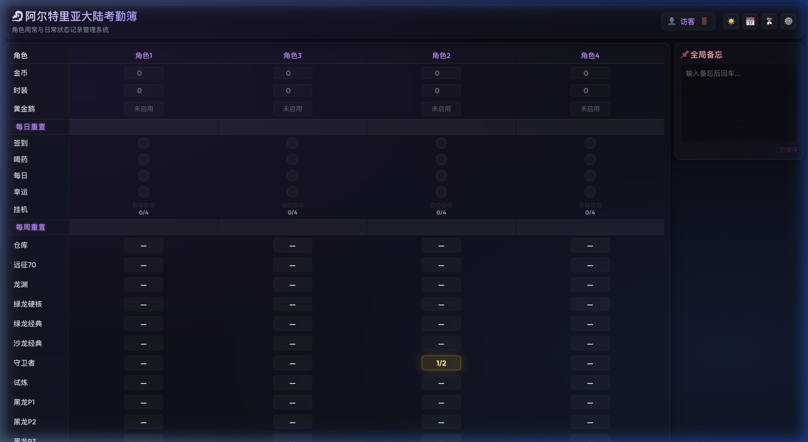
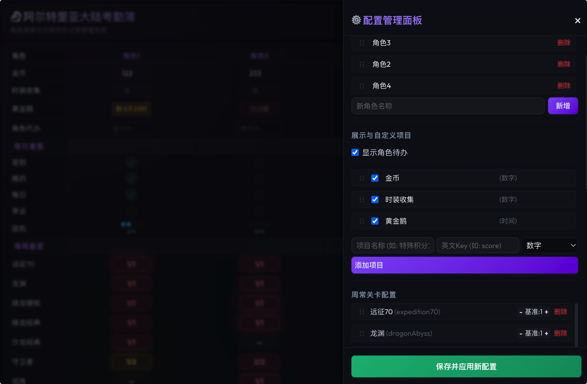

# 🐉 Alteia Ledger (altea-ledger)

This is a **high-density, dark frosted glass (Glassmorphism) style** character weekly and daily status tracking system designed specifically for Dragon Nest players. It completely replaces cumbersome, hard-to-use traditional Excel sheets, providing intuitive multi-character management, automatic cycle reset, online configuration management, in-game gold balance ledger, and weekly history snapshot archiving & backup features.

### 📸 Preview

| Main Tracker | Configuration Panel |
| :---: | :---: |
|  |  |

---

## ✨ Core Features

- 🎮 **Multi-Character Management**: Supports displaying multiple characters side-by-side for quick viewing and management on a single screen.
- ⚡ **Smart Cycle Reset**:
  - **Daily Reset**: Automatically resets daily states every day at **09:00 AM** by default, with support for configuring independent reset hours for specific tasks (e.g., **00:00 AM** for the "AFK" task).
  - **Weekly Reset**: Automatically resets weekly dungeons/stages every Saturday at **09:00 AM**, creating a historical snapshot beforehand.
  - **Auto Trigger**: No background persistent timers. The backend automatically performs silent resets and data alignment based on client request timestamps.
- 🦢 **Custom Tracking & Management**:
  - Dynamically enable default assets or add customized items (types supported: Number, Countdown Card, and Multi-stage Progress Dots).
  - Hide, rename, and sort all assets and tracking items visually via drag-and-drop.
- 📈 **Gold Ledger & Balance Statistics**:
  - Record gold transactions (supports categorizing general income/expenses and "RMT buying/selling", recording rates, fees, and auto-filling remarks).
  - Group transactions by year and month in collapsible tables. Supports importing/exporting raw comma-separated text back-ups. Displays records in reverse chronological order.
- ⏳ **History Snapshot Archiving**:
  - Automatically creates a historical snapshot of all states and memos during weekly resets (stores up to 50 versions, auto-purging oldest).
  - Review archived data in a read-only detailed layout sidebar drawer or table modal, with a secure option to clear all archives.
- 📌 **Flowing Memo Tags**:
  - Tag-style memo board. Press Enter to add a tag, click `×` to delete. Memos are archived along with weekly history snapshots.
- 🔒 **Multi-User Isolation & Validation**:
  - Configure credentials via environment variables for multi-user authentication. User data is physically isolated in separate config, data, and history files.
  - Backward compatible with single-user password verification (`ADMIN_PASSWORD`) and guest mode. Remembers credentials using `LocalStorage` with a logout button.
- 📧 **Automatic & Manual Email Backup**:
  - Bind a sender email (e.g., Gmail, Outlook, QQ Mail). Before weekly resets clear your weekly dungeon progress, it silently sends the configuration, character progress, and history files as email attachments in the background.
  - One-click "Send Test Backup Email" button in the settings drawer for instant on-demand manual backups.

---

## 🚀 Quick Start

### 1. Install Dependencies

```bash
npm install
```

### 2. Local Development Mode

Start the frontend Vite development server and the backend Express API server simultaneously (frontend is pre-configured to proxy `/api` requests to `localhost:3001`):

```bash
# Start Vite frontend (default port 5173)
npm run dev

# Start Express backend (default port 3001)
npm run server
```

### 3. Production Build & Start

```bash
npm start
```
> This command runs `npm run build` to package the frontend assets and hosts them directly on Express at port `3001` along with the API. Visit: **[http://localhost:3001](http://localhost:3001)**

---

## 🐳 Docker Deployment

### 1. Run Container Directly

```bash
docker run -d \
  -p 3001:3001 \
  -v $(pwd)/data:/app/data \
  -e TZ=Asia/Shanghai \
  -e USERS_AUTH="User1:pass123,User2:pwd456" \
  --name altea-ledger \
  aichenk/altea-ledger:latest
```

### 2. Deploy with Docker Compose

Deploy using the `docker-compose.yml` file located in the project root:

```yaml
version: '3.8'

services:
  altea-ledger:
    image: aichenk/altea-ledger:latest
    container_name: altea-ledger
    ports:
      - "3001:3001"
    volumes:
      - ./data:/app/data
    environment:
      - TZ=Asia/Shanghai
      - PORT=3001
      - USERS_AUTH=User1:pass123,User2:pwd456  # Multi-user config, format: "Nickname1:Password1,Nickname2:Password2"
      - ADMIN_PASSWORD=your_password        # Single-user password (only takes effect if USERS_AUTH is not set)
    restart: always
```

### 3. Environment Variables

| Variable | Description | Default / Example |
| :--- | :--- | :--- |
| `TZ` | Container timezone. Reset logic heavily depends on this config | `Asia/Shanghai` |
| `USERS_AUTH` | Multi-user credentials, comma-separated. Passwords must be unique | `User1:pwd1,User2:pwd2` |
| `ADMIN_PASSWORD` | Single-user access password (can be modified in settings) | `your_password` |
| `PORT` | Server listening port | `3001` |
| `SMTP_HOST` | Mail server SMTP host name | `smtp.gmail.com` |
| `SMTP_PORT` | Mail server SMTP port | `465` (utilizes SSL) |
| `SMTP_USER` | Email account used for sending | `sender_account@gmail.com` |
| `SMTP_PASS` | SMTP application-specific auth code (not your login password) | `abcdefghijklmnop` |

> [!IMPORTANT]
> **Data Persistence & Initialization**:
> - All application data is stored in `/app/data` inside the container. Mount `-v $(pwd)/data:/app/data` to persist your data.
> - **First-time Run**: If the host folder `./data` is empty, make sure to copy the `data/config.json` template file from the source code into the mounted host folder beforehand. Otherwise, the system will fail to load default layouts due to missing configurations.
